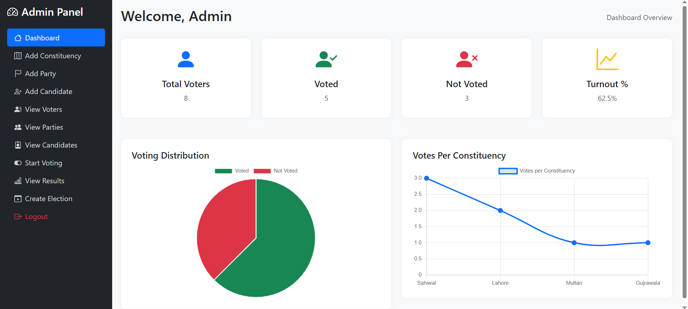

# Election-Management-System
The Election Management System (EMS) is a web app built with Django, MySQL, and Bootstrap. It features secure OTP authentication, role-based access for admins, voters, and candidates, time-controlled elections, and real-time results, providing a transparent and user-friendly digital voting process.

##  Features

- **Voter Management:** Registration and secure login.
- **OTP Authentication:** Email OTP for login verification (configure Gmail in `settings.py`).
- **Admin Panel:** Add candidates, manage elections, view voters and results.
- **Voting Panel:** One vote per voter, linked to CNIC.
- **Real-Time Results:** Results per constituency and party.
- **Database Support:** MySQL (other databases can be configured).
- **Deployment Ready:** Works locally and on a server.

---

## Screenshots


### Admin Panel


### Voter Panel


---

##  Installation

1. **Clone the repository:**
```bash
git clone https://github.com/abubakar-shabbir/Election-Management-System.git
cd Election-Management-System 
```
2. **Create a virtual environment:** 
```bash
python -m venv venv
# Activate on Windows
venv\Scripts\activate
# Activate on Mac/Linux
source venv/bin/activate
```
3. **Install dependencies:**
```bash
pip install -r requirements.txt
```

4. **Configure Database in settings.py:**
```bash
DATABASES = {
    'default': {
        'ENGINE': 'django.db.backends.mysql',
        'NAME': 'your_db_name',
        'USER': 'your_db_user',
        'PASSWORD': 'your_db_password',
        'HOST': 'localhost',
        'PORT': '3306',
    }
}
```
5. **Configure Email OTP in settings.py:**
```bash
EMAIL_BACKEND = 'django.core.mail.backends.smtp.EmailBackend'
EMAIL_HOST = 'smtp.gmail.com'
EMAIL_PORT = 587
EMAIL_USE_TLS = True
EMAIL_HOST_USER = 'your-app-email@gmail.com'
EMAIL_HOST_PASSWORD = 'your-app-password'  # Use App Password
```

6. **Run migrations:**
```bash
python manage.py makemigrations
python manage.py migrate
```

7. **Start the server:**
```bash
python manage.py runserver
```


##  Usage

- **Homepage Selection:** On the homepage, users can select their role:
  - **Voter:** Can register or log in via `Home Page`.
  - **Admin:** Must be created via Django’s default admin panel (`/admin`). Admin accounts **cannot** be registered through the website.

- **Voting Rules:**
  - Each voter is linked to their **CNIC**.
  - A voter can cast a vote **only once**.

- **Admin Capabilities (via Django Admin Portal):**
  - Add candidates.
  - Start and manage elections.
  - Monitor results and view voters.

- **Voter Capabilities (via Website):**
  - Register/login.
  - Cast vote in elections they are eligible for.


# **Contributing**

Fork the repository

Create a new branch (```git checkout -b feature-name```)

Commit your changes (```git commit -m 'Add feature'```)

Push to the branch (```git push origin feature-name```)

Open a pull request

# **📜 License**

MIT License © 2025 Abubakar Shabbir

